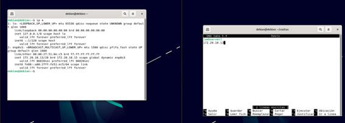
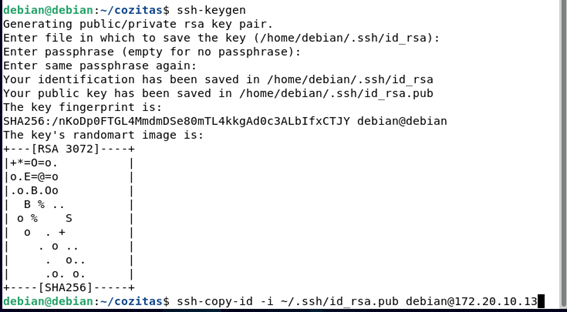

# Configurar un playbook en Ansible:
### Los playbooks nos permiten gestionar la configuración del despliegue:
creamos el siguiente archivo apuntando a la ip de destino dentro de una carpeta que llamaremos cozitas:

#### Creamos relación de confianza con los siguientes comandos

