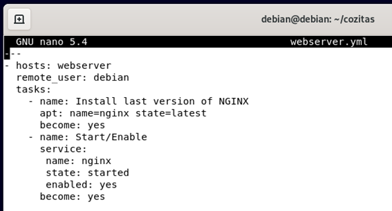
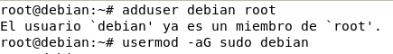
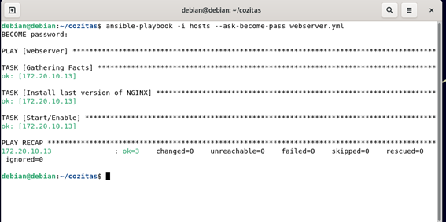
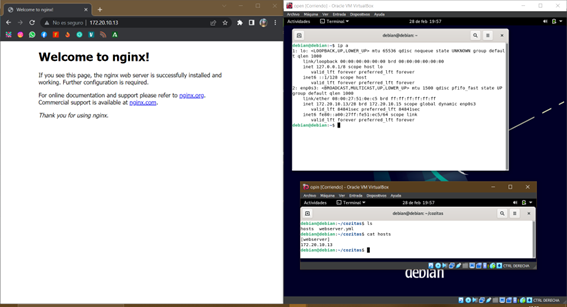

# Desplegar servicios en Ansible :
#### Desplegamos el siguiente yml 

#### Damos los permisos desde la maquina cliente para el usuario debian :

#### Finalmente si nos conectamos con la ip de la máquina cliente veremos el servidor instalado 

